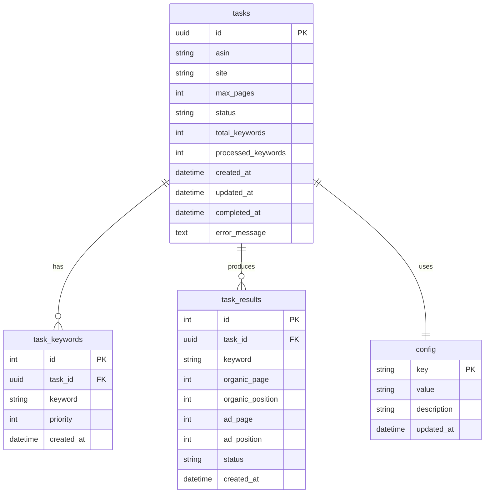

# ASIN 排名追踪器 - 数据库设计

**版本**: 1.0  
**创建时间**: 2026-04-12  
**作者**: design-agent

---

## 一、ER 图



---

## 二、表结构设计

### 2.1 tasks 表

任务主表，存储每个排名追踪任务的基本信息。

| 字段名 | 数据类型 | 约束 | 说明 |
|--------|----------|------|------|
| id | VARCHAR(36) | PRIMARY KEY | 任务 ID（UUID） |
| asin | VARCHAR(10) | NOT NULL | 产品 ASIN（大写） |
| site | VARCHAR(50) | NOT NULL DEFAULT 'amazon.com' | 亚马逊站点 |
| max_pages | INT | NOT NULL DEFAULT 5 | 最大翻页数（1-50） |
| status | VARCHAR(20) | NOT NULL DEFAULT 'pending' | 任务状态 |
| total_keywords | INT | NOT NULL | 关键词总数 |
| processed_keywords | INT | NOT NULL DEFAULT 0 | 已处理关键词数 |
| created_at | DATETIME | NOT NULL DEFAULT CURRENT_TIMESTAMP | 创建时间 |
| updated_at | DATETIME | NOT NULL DEFAULT CURRENT_TIMESTAMP ON UPDATE CURRENT_TIMESTAMP | 更新时间 |
| completed_at | DATETIME | NULL | 完成时间 |
| error_message | TEXT | NULL | 错误信息（失败时） |

**状态枚举值**:
- `pending`: 等待执行
- `running`: 执行中
- `completed`: 已完成
- `failed`: 失败
- `cancelled`: 已取消

### 2.2 task_keywords 表

任务关键词表，存储每个任务关联的关键词列表。

| 字段名 | 数据类型 | 约束 | 说明 |
|--------|----------|------|------|
| id | INT | PRIMARY KEY AUTO_INCREMENT | 自增 ID |
| task_id | VARCHAR(36) | NOT NULL, FOREIGN KEY | 关联任务 ID |
| keyword | VARCHAR(200) | NOT NULL | 关键词文本 |
| priority | INT | NOT NULL DEFAULT 0 | 处理优先级（可选） |
| created_at | DATETIME | NOT NULL DEFAULT CURRENT_TIMESTAMP | 创建时间 |

### 2.3 task_results 表

任务结果表，存储每个关键词的排名结果。

| 字段名 | 数据类型 | 约束 | 说明 |
|--------|----------|------|------|
| id | INT | PRIMARY KEY AUTO_INCREMENT | 自增 ID |
| task_id | VARCHAR(36) | NOT NULL, FOREIGN KEY | 关联任务 ID |
| keyword | VARCHAR(200) | NOT NULL | 关键词文本（冗余存储，便于查询） |
| organic_page | INT | NULL | 自然排名页码（null 表示未找到） |
| organic_position | INT | NULL | 自然排名页内位置（1-48） |
| ad_page | INT | NULL | 广告排名页码（null 表示未找到） |
| ad_position | INT | NULL | 广告排名页内位置（1-4） |
| status | VARCHAR(30) | NOT NULL | 结果状态 |
| created_at | DATETIME | NOT NULL DEFAULT CURRENT_TIMESTAMP | 爬取时间 |

**结果状态枚举值**:
- `found`: 自然排名和广告排名都找到
- `organic_not_found`: 仅自然排名未找到
- `ad_not_found`: 仅广告排名未找到
- `not_found`: 自然排名和广告排名都未找到
- `error`: 爬取过程出错
- `captcha`: 遇到验证码

### 2.4 config 表

配置表，存储系统配置项。

| 字段名 | 数据类型 | 约束 | 说明 |
|--------|----------|------|------|
| key | VARCHAR(100) | PRIMARY KEY | 配置键 |
| value | TEXT | NOT NULL | 配置值（JSON 格式） |
| description | VARCHAR(500) | NULL | 配置描述 |
| updated_at | DATETIME | NOT NULL DEFAULT CURRENT_TIMESTAMP ON UPDATE CURRENT_TIMESTAMP | 更新时间 |

**预设配置项**:

| key | value 示例 | 说明 |
|-----|-----------|------|
| `crawler.max_concurrent_browsers` | `3` | 最大并发浏览器数 |
| `crawler.max_concurrent_tasks` | `5` | 最大并发任务数 |
| `crawler.request_delay_min` | `2` | 请求最小延迟（秒） |
| `crawler.request_delay_max` | `5` | 请求最大延迟（秒） |
| `crawler.max_retries` | `3` | 最大重试次数 |
| `crawler.proxy_list` | `["proxy1:8080", "proxy2:8080"]` | 代理列表（JSON） |
| `crawler.user_agents` | `[...]` | User-Agent 列表（JSON） |
| `sites.supported` | `["amazon.com", "amazon.co.uk", ...]` | 支持的站点列表 |

---

## 三、索引设计

### 3.1 tasks 表索引

```sql
-- 主键索引（自动创建）
PRIMARY KEY (id)

-- 状态查询索引（常用：查询待处理任务、运行中任务）
INDEX idx_tasks_status (status)

-- 创建时间索引（常用：按时间排序查询任务列表）
INDEX idx_tasks_created_at (created_at DESC)

-- 复合索引：状态 + 创建时间（常用：查询某状态的任务并按时间排序）
INDEX idx_tasks_status_created (status, created_at DESC)

-- ASIN 查询索引（可选：按 ASIN 查询历史任务）
INDEX idx_tasks_asin (asin)
```

### 3.2 task_keywords 表索引

```sql
-- 主键索引（自动创建）
PRIMARY KEY (id)

-- 外键索引（加速关联查询）
INDEX idx_task_keywords_task_id (task_id)

-- 复合索引：task_id + priority（按优先级处理关键词）
INDEX idx_task_keywords_task_priority (task_id, priority ASC)
```

### 3.3 task_results 表索引

```sql
-- 主键索引（自动创建）
PRIMARY KEY (id)

-- 外键索引（加速关联查询）
INDEX idx_task_results_task_id (task_id)

-- 复合索引：task_id + keyword（查询任务结果时常用）
INDEX idx_task_results_task_keyword (task_id, keyword)

-- 状态统计索引（可选：统计某任务各状态结果数量）
INDEX idx_task_results_task_status (task_id, status)
```

### 3.4 config 表索引

```sql
-- 主键索引（自动创建）
PRIMARY KEY (key)
```

---

## 四、SQL 建表语句

### 4.1 创建数据库

```sql
CREATE DATABASE IF NOT EXISTS asin_ranker
    CHARACTER SET utf8mb4
    COLLATE utf8mb4_unicode_ci;

USE asin_ranker;
```

### 4.2 创建 tasks 表

```sql
CREATE TABLE IF NOT EXISTS tasks (
    id VARCHAR(36) PRIMARY KEY COMMENT '任务 ID (UUID)',
    asin VARCHAR(10) NOT NULL COMMENT '产品 ASIN',
    site VARCHAR(50) NOT NULL DEFAULT 'amazon.com' COMMENT '亚马逊站点',
    max_pages INT NOT NULL DEFAULT 5 COMMENT '最大翻页数 (1-50)',
    status VARCHAR(20) NOT NULL DEFAULT 'pending' COMMENT '任务状态',
    total_keywords INT NOT NULL COMMENT '关键词总数',
    processed_keywords INT NOT NULL DEFAULT 0 COMMENT '已处理关键词数',
    created_at DATETIME NOT NULL DEFAULT CURRENT_TIMESTAMP COMMENT '创建时间',
    updated_at DATETIME NOT NULL DEFAULT CURRENT_TIMESTAMP ON UPDATE CURRENT_TIMESTAMP COMMENT '更新时间',
    completed_at DATETIME NULL COMMENT '完成时间',
    error_message TEXT NULL COMMENT '错误信息',
    
    INDEX idx_tasks_status (status),
    INDEX idx_tasks_created_at (created_at DESC),
    INDEX idx_tasks_status_created (status, created_at DESC),
    INDEX idx_tasks_asin (asin)
) ENGINE=InnoDB DEFAULT CHARSET=utf8mb4 COLLATE=utf8mb4_unicode_ci COMMENT='任务主表';
```

### 4.3 创建 task_keywords 表

```sql
CREATE TABLE IF NOT EXISTS task_keywords (
    id INT AUTO_INCREMENT PRIMARY KEY COMMENT '自增 ID',
    task_id VARCHAR(36) NOT NULL COMMENT '关联任务 ID',
    keyword VARCHAR(200) NOT NULL COMMENT '关键词文本',
    priority INT NOT NULL DEFAULT 0 COMMENT '处理优先级',
    created_at DATETIME NOT NULL DEFAULT CURRENT_TIMESTAMP COMMENT '创建时间',
    
    CONSTRAINT fk_task_keywords_task
        FOREIGN KEY (task_id) REFERENCES tasks(id) ON DELETE CASCADE,
    
    INDEX idx_task_keywords_task_id (task_id),
    INDEX idx_task_keywords_task_priority (task_id, priority ASC)
) ENGINE=InnoDB DEFAULT CHARSET=utf8mb4 COLLATE=utf8mb4_unicode_ci COMMENT='任务关键词表';
```

### 4.4 创建 task_results 表

```sql
CREATE TABLE IF NOT EXISTS task_results (
    id INT AUTO_INCREMENT PRIMARY KEY COMMENT '自增 ID',
    task_id VARCHAR(36) NOT NULL COMMENT '关联任务 ID',
    keyword VARCHAR(200) NOT NULL COMMENT '关键词文本',
    organic_page INT NULL COMMENT '自然排名页码',
    organic_position INT NULL COMMENT '自然排名页内位置',
    ad_page INT NULL COMMENT '广告排名页码',
    ad_position INT NULL COMMENT '广告排名页内位置',
    status VARCHAR(30) NOT NULL COMMENT '结果状态',
    created_at DATETIME NOT NULL DEFAULT CURRENT_TIMESTAMP COMMENT '爬取时间',
    
    CONSTRAINT fk_task_results_task
        FOREIGN KEY (task_id) REFERENCES tasks(id) ON DELETE CASCADE,
    
    INDEX idx_task_results_task_id (task_id),
    INDEX idx_task_results_task_keyword (task_id, keyword),
    INDEX idx_task_results_task_status (task_id, status)
) ENGINE=InnoDB DEFAULT CHARSET=utf8mb4 COLLATE=utf8mb4_unicode_ci COMMENT='任务结果表';
```

### 4.5 创建 config 表

```sql
CREATE TABLE IF NOT EXISTS config (
    `key` VARCHAR(100) PRIMARY KEY COMMENT '配置键',
    value TEXT NOT NULL COMMENT '配置值 (JSON 格式)',
    description VARCHAR(500) NULL COMMENT '配置描述',
    updated_at DATETIME NOT NULL DEFAULT CURRENT_TIMESTAMP ON UPDATE CURRENT_TIMESTAMP COMMENT '更新时间'
) ENGINE=InnoDB DEFAULT CHARSET=utf8mb4 COLLATE=utf8mb4_unicode_ci COMMENT='系统配置表';
```

### 4.6 初始化配置数据

```sql
INSERT INTO config (`key`, value, description) VALUES
    ('crawler.max_concurrent_browsers', '3', '最大并发浏览器实例数'),
    ('crawler.max_concurrent_tasks', '5', '最大并发任务数'),
    ('crawler.request_delay_min', '2', '请求最小延迟（秒）'),
    ('crawler.request_delay_max', '5', '请求最大延迟（秒）'),
    ('crawler.max_retries', '3', '最大重试次数'),
    ('crawler.proxy_list', '[]', '代理列表（JSON 数组）'),
    ('crawler.user_agents', '[]', 'User-Agent 列表（JSON 数组）'),
    ('sites.supported', '["amazon.com", "amazon.co.uk", "amazon.de", "amazon.fr", "amazon.co.jp", "amazon.ca", "amazon.com.au"]', '支持的亚马逊站点列表');
```

---

## 五、常用查询语句

### 5.1 创建任务

```sql
-- 插入任务
INSERT INTO tasks (id, asin, site, max_pages, status, total_keywords)
VALUES ('550e8400-e29b-41d4-a716-446655440000', 'B08N5WRWNW', 'amazon.com', 5, 'pending', 10);

-- 批量插入关键词
INSERT INTO task_keywords (task_id, keyword, priority) VALUES
    ('550e8400-e29b-41d4-a716-446655440000', 'wireless earbuds', 0),
    ('550e8400-e29b-41d4-a716-446655440000', 'bluetooth headphones', 0),
    ('550e8400-e29b-41d4-a716-446655440000', 'noise cancelling earbuds', 0);
```

### 5.2 更新任务状态

```sql
-- 更新为运行中
UPDATE tasks 
SET status = 'running', updated_at = NOW()
WHERE id = '550e8400-e29b-41d4-a716-446655440000';

-- 更新进度
UPDATE tasks 
SET processed_keywords = processed_keywords + 1, updated_at = NOW()
WHERE id = '550e8400-e29b-41d4-a716-446655440000';

-- 更新为已完成
UPDATE tasks 
SET status = 'completed', completed_at = NOW(), updated_at = NOW()
WHERE id = '550e8400-e29b-41d4-a716-446655440000';

-- 更新为失败
UPDATE tasks 
SET status = 'failed', error_message = '连接超时', completed_at = NOW(), updated_at = NOW()
WHERE id = '550e8400-e29b-41d4-a716-446655440000';
```

### 5.3 插入结果

```sql
-- 插入单个结果
INSERT INTO task_results (task_id, keyword, organic_page, organic_position, ad_page, ad_position, status)
VALUES (
    '550e8400-e29b-41d4-a716-446655440000',
    'wireless earbuds',
    3, 12,  -- 自然排名：第 3 页第 12 位
    1, 4,   -- 广告排名：第 1 页第 4 位
    'found'
);

-- 批量插入结果
INSERT INTO task_results (task_id, keyword, organic_page, organic_position, ad_page, ad_position, status)
VALUES
    ('550e8400-e29b-41d4-a716-446655440000', 'keyword1', 1, 5, NULL, NULL, 'ad_not_found'),
    ('550e8400-e29b-41d4-a716-446655440000', 'keyword2', NULL, NULL, 2, 3, 'organic_not_found'),
    ('550e8400-e29b-41d4-a716-446655440000', 'keyword3', NULL, NULL, NULL, NULL, 'not_found');
```

### 5.4 查询任务列表

```sql
-- 查询所有任务（按创建时间倒序）
SELECT 
    id, asin, site, status, total_keywords, processed_keywords,
    created_at, completed_at
FROM tasks
ORDER BY created_at DESC
LIMIT 20 OFFSET 0;

-- 查询特定状态的任务
SELECT * FROM tasks
WHERE status = 'running'
ORDER BY created_at DESC;

-- 查询某 ASIN 的历史任务
SELECT * FROM tasks
WHERE asin = 'B08N5WRWNW'
ORDER BY created_at DESC;

-- 统计各状态任务数量
SELECT status, COUNT(*) as count
FROM tasks
GROUP BY status;
```

### 5.5 查询任务结果

```sql
-- 查询任务完整结果
SELECT 
    keyword,
    organic_page,
    organic_position,
    ad_page,
    ad_position,
    status,
    created_at
FROM task_results
WHERE task_id = '550e8400-e29b-41d4-a716-446655440000'
ORDER BY keyword;

-- 统计结果状态分布
SELECT status, COUNT(*) as count
FROM task_results
WHERE task_id = '550e8400-e29b-41d4-a716-446655440000'
GROUP BY status;

-- 查询找到排名的关键词
SELECT keyword, organic_page, organic_position, ad_page, ad_position
FROM task_results
WHERE task_id = '550e8400-e29b-41d4-a716-446655440000'
    AND status = 'found'
ORDER BY organic_page, organic_position;
```

### 5.6 查询任务进度

```sql
-- 查询任务进度百分比
SELECT 
    id,
    status,
    total_keywords,
    processed_keywords,
    ROUND(processed_keywords * 100.0 / total_keywords, 2) as progress_percent
FROM tasks
WHERE id = '550e8400-e29b-41d4-a716-446655440000';

-- 查询运行中任务的详细进度
SELECT 
    t.id,
    t.status,
    t.total_keywords,
    t.processed_keywords,
    COUNT(r.id) as actual_results,
    SUM(CASE WHEN r.status = 'found' THEN 1 ELSE 0 END) as found_count
FROM tasks t
LEFT JOIN task_results r ON t.id = r.task_id
WHERE t.status = 'running'
GROUP BY t.id;
```

### 5.7 清理历史数据

```sql
-- 删除 30 天前的已完成任务
DELETE t, k, r
FROM tasks t
LEFT JOIN task_keywords k ON t.id = k.task_id
LEFT JOIN task_results r ON t.id = r.task_id
WHERE t.status IN ('completed', 'cancelled', 'failed')
    AND t.completed_at < DATE_SUB(NOW(), INTERVAL 30 DAY);

-- 清空配置表（谨慎使用）
TRUNCATE TABLE config;
```

---

## 六、数据库连接池配置

### 6.1 Python aiomysql 配置

```python
# app/db/connection.py
from aiomysql import create_pool

async def init_db_pool(config):
    pool = await create_pool(
        host=config.DB_HOST,
        port=config.DB_PORT,
        user=config.DB_USER,
        password=config.DB_PASSWORD,
        db=config.DB_NAME,
        minsize=5,      # 最小连接数
        maxsize=20,     # 最大连接数
        autocommit=True,
        charset='utf8mb4',
        pool_recycle=3600,  # 连接回收时间（秒）
    )
    return pool

async def get_connection(pool):
    async with pool.acquire() as conn:
        yield conn
```

### 6.2 连接池监控

```sql
-- 查看当前连接数
SHOW STATUS LIKE 'Threads_connected';

-- 查看最大连接数配置
SHOW VARIABLES LIKE 'max_connections';

-- 查看慢查询
SHOW VARIABLES LIKE 'slow_query_log';
SHOW VARIABLES LIKE 'long_query_time';
```

---

## 七、性能优化建议

### 7.1 分区表（可选）

对于数据量大的场景，可以对 `task_results` 表按月分区：

```sql
ALTER TABLE task_results
PARTITION BY RANGE (YEAR(created_at) * 100 + MONTH(created_at)) (
    PARTITION p202601 VALUES LESS THAN (202602),
    PARTITION p202602 VALUES LESS THAN (202603),
    PARTITION p202603 VALUES LESS THAN (202604),
    PARTITION p202604 VALUES LESS THAN (202605),
    PARTITION p_future VALUES LESS THAN MAXVALUE
);
```

### 7.2 读写分离（可选）

对于高并发场景，可以配置主从复制：

- 主库：写操作（INSERT/UPDATE/DELETE）
- 从库：读操作（SELECT）

### 7.3 缓存层（可选）

对于频繁查询的任务状态，可以使用 Redis 缓存：

```python
# 缓存任务状态（5 分钟过期）
await redis.setex(f"task:{task_id}:status", 300, status_json)

# 查询时先读缓存
cached = await redis.get(f"task:{task_id}:status")
if cached:
    return cached
```

---

## 八、数据字典

### 8.1 字段类型说明

| MySQL 类型 | Python 类型 | 说明 |
|-----------|------------|------|
| VARCHAR(36) | str | UUID 字符串 |
| VARCHAR(10) | str | ASIN |
| VARCHAR(50) | str | 站点域名 |
| INT | int | 整数 |
| DATETIME | datetime | 日期时间 |
| TEXT | str | 长文本 |

### 8.2 约束说明

| 约束类型 | 说明 |
|----------|------|
| PRIMARY KEY | 主键，唯一且非空 |
| FOREIGN KEY | 外键，关联其他表 |
| NOT NULL | 非空约束 |
| DEFAULT | 默认值 |
| AUTO_INCREMENT | 自增 |
| ON DELETE CASCADE | 级联删除 |

---

**文档结束**
