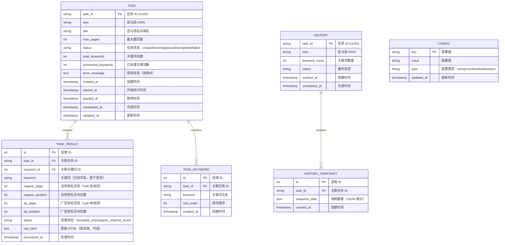

# ASIN 关键词排名追踪器 - 数据库 ER 图

## 1. ER 图（Mermaid 格式）



## 2. 数据表详细说明

### 2.1 tasks 表

存储任务基本信息和状态。

| 字段名 | 类型 | 约束 | 说明 |
|--------|------|------|------|
| task_id | VARCHAR(36) | PRIMARY KEY | UUID 格式的任务 ID |
| asin | VARCHAR(10) | NOT NULL | 亚马逊 ASIN |
| site | VARCHAR(50) | NOT NULL DEFAULT 'amazon.com' | 亚马逊站点域名 |
| max_pages | INTEGER | NOT NULL DEFAULT 5 | 最大翻页数（1-50） |
| status | VARCHAR(20) | NOT NULL DEFAULT 'created' | 任务状态 |
| total_keywords | INTEGER | NOT NULL | 关键词总数 |
| processed_keywords | INTEGER | NOT NULL DEFAULT 0 | 已处理关键词数 |
| error_message | TEXT | NULL | 错误信息（失败时） |
| created_at | TIMESTAMP | NOT NULL DEFAULT CURRENT_TIMESTAMP | 创建时间 |
| started_at | TIMESTAMP | NULL | 开始执行时间 |
| paused_at | TIMESTAMP | NULL | 暂停时间 |
| completed_at | TIMESTAMP | NULL | 完成时间 |
| updated_at | TIMESTAMP | NOT NULL DEFAULT CURRENT_TIMESTAMP | 更新时间 |

**索引：**
- `idx_tasks_status` (status)
- `idx_tasks_created_at` (created_at DESC)
- `idx_tasks_asin` (asin)

### 2.2 task_keywords 表

存储任务的关键词列表。

| 字段名 | 类型 | 约束 | 说明 |
|--------|------|------|------|
| id | INTEGER | PRIMARY KEY AUTOINCREMENT | 自增 ID |
| task_id | VARCHAR(36) | NOT NULL, FOREIGN KEY | 关联 tasks 表 |
| keyword | VARCHAR(100) | NOT NULL | 关键词文本 |
| sort_order | INTEGER | NOT NULL | 排序顺序（保持输入顺序） |
| created_at | TIMESTAMP | NOT NULL DEFAULT CURRENT_TIMESTAMP | 创建时间 |

**索引：**
- `idx_keywords_task_id` (task_id)
- `idx_keywords_task_sort` (task_id, sort_order)

### 2.3 task_results 表

存储爬取结果数据。

| 字段名 | 类型 | 约束 | 说明 |
|--------|------|------|------|
| id | INTEGER | PRIMARY KEY AUTOINCREMENT | 自增 ID |
| task_id | VARCHAR(36) | NOT NULL, FOREIGN KEY | 关联 tasks 表 |
| keyword_id | INTEGER | NOT NULL, FOREIGN KEY | 关联 task_keywords 表 |
| keyword | VARCHAR(100) | NOT NULL | 关键词（冗余，便于查询） |
| organic_page | INTEGER | NULL | 自然排名页码（null=未找到） |
| organic_position | INTEGER | NULL | 自然排名页内位置 |
| ad_page | INTEGER | NULL | 广告排名页码（null=未找到） |
| ad_position | INTEGER | NULL | 广告排名页内位置 |
| status | VARCHAR(20) | NOT NULL | 结果状态 |
| raw_html | TEXT | NULL | 原始 HTML（可选，用于调试） |
| processed_at | TIMESTAMP | NOT NULL DEFAULT CURRENT_TIMESTAMP | 处理时间 |

**索引：**
- `idx_results_task_id` (task_id)
- `idx_results_task_keyword` (task_id, keyword)
- `idx_results_status` (status)
- `idx_results_organic` (organic_page, organic_position)
- `idx_results_ad` (ad_page, ad_position)

### 2.4 history 表

存储历史记录摘要（最近 10 条）。

| 字段名 | 类型 | 约束 | 说明 |
|--------|------|------|------|
| task_id | VARCHAR(36) | PRIMARY KEY | 任务 ID |
| asin | VARCHAR(10) | NOT NULL | 亚马逊 ASIN |
| keyword_count | INTEGER | NOT NULL | 关键词数量 |
| status | VARCHAR(20) | NOT NULL | 最终状态 |
| created_at | TIMESTAMP | NOT NULL | 创建时间 |
| completed_at | TIMESTAMP | NULL | 完成时间 |

**索引：**
- `idx_history_created_at` (created_at DESC)

### 2.5 history_snapshots 表

存储历史任务的完整快照（JSON 格式）。

| 字段名 | 类型 | 约束 | 说明 |
|--------|------|------|------|
| id | INTEGER | PRIMARY KEY AUTOINCREMENT | 自增 ID |
| task_id | VARCHAR(36) | NOT NULL, FOREIGN KEY | 关联 history 表 |
| snapshot_data | TEXT | NOT NULL | JSON 格式的快照数据 |
| created_at | TIMESTAMP | NOT NULL DEFAULT CURRENT_TIMESTAMP | 创建时间 |

### 2.6 config 表

存储系统配置。

| 字段名 | 类型 | 约束 | 说明 |
|--------|------|------|------|
| key | VARCHAR(50) | PRIMARY KEY | 配置键 |
| value | TEXT | NOT NULL | 配置值 |
| type | VARCHAR(20) | NOT NULL | 配置类型 |
| updated_at | TIMESTAMP | NOT NULL DEFAULT CURRENT_TIMESTAMP | 更新时间 |

**示例数据：**
```json
{
  "key": "request_delay_min",
  "value": "2000",
  "type": "number"
}
{
  "key": "request_delay_max",
  "value": "5000",
  "type": "number"
}
{
  "key": "max_retries",
  "value": "3",
  "type": "number"
}
{
  "key": "supported_sites",
  "value": "[\"amazon.com\",\"amazon.co.uk\",\"amazon.de\"]",
  "type": "json"
}
```

---

## 3. 状态枚举定义

### 3.1 任务状态 (task.status)

| 状态值 | 说明 | 转换条件 |
|--------|------|----------|
| created | 已创建 | 任务提交后初始状态 |
| running | 运行中 | 开始执行爬虫任务 |
| paused | 已暂停 | 用户主动暂停或检测到验证码 |
| completed | 已完成 | 所有关键词处理完成 |
| failed | 失败 | 发生不可恢复的错误 |

### 3.2 结果状态 (task_result.status)

| 状态值 | 说明 | 条件 |
|--------|------|------|
| found | 找到 | 自然排名和广告排名都找到 |
| ad_only | 仅广告 | 只找到广告排名 |
| organic_only | 仅自然 | 只找到自然排名 |
| not_found | 未找到 | 自然排名和广告排名都未找到 |

---

## 4. 数据关系说明

### 4.1 一对多关系

- **tasks → task_keywords**: 一个任务包含多个关键词（1:N）
- **tasks → task_results**: 一个任务包含多个结果记录（1:N）
- **task_keywords → task_results**: 一个关键词对应一个结果记录（1:1）
- **history → history_snapshots**: 一个历史记录可包含多个快照（1:N）

### 4.2 数据生命周期

```
任务创建 → 关键词入库 → 执行爬取 → 结果入库 → 任务完成 → 历史归档
   ↓           ↓            ↓           ↓           ↓           ↓
tasks     task_keywords  (爬虫)   task_results  更新 status  history
```

### 4.3 数据清理策略

- **临时数据**: 原始 HTML（raw_html）在任务完成 7 天后清理
- **历史记录**: 保留最近 100 条完整记录，更早的记录仅保留摘要
- **配置数据**: 永久保存，除非手动删除

---

## 5. SQL 建表语句

### 5.1 tasks 表

```sql
CREATE TABLE tasks (
    task_id VARCHAR(36) PRIMARY KEY,
    asin VARCHAR(10) NOT NULL,
    site VARCHAR(50) NOT NULL DEFAULT 'amazon.com',
    max_pages INTEGER NOT NULL DEFAULT 5,
    status VARCHAR(20) NOT NULL DEFAULT 'created',
    total_keywords INTEGER NOT NULL,
    processed_keywords INTEGER NOT NULL DEFAULT 0,
    error_message TEXT,
    created_at TIMESTAMP NOT NULL DEFAULT CURRENT_TIMESTAMP,
    started_at TIMESTAMP,
    paused_at TIMESTAMP,
    completed_at TIMESTAMP,
    updated_at TIMESTAMP NOT NULL DEFAULT CURRENT_TIMESTAMP
);

CREATE INDEX idx_tasks_status ON tasks(status);
CREATE INDEX idx_tasks_created_at ON tasks(created_at DESC);
CREATE INDEX idx_tasks_asin ON tasks(asin);
```

### 5.2 task_keywords 表

```sql
CREATE TABLE task_keywords (
    id INTEGER PRIMARY KEY AUTOINCREMENT,
    task_id VARCHAR(36) NOT NULL,
    keyword VARCHAR(100) NOT NULL,
    sort_order INTEGER NOT NULL,
    created_at TIMESTAMP NOT NULL DEFAULT CURRENT_TIMESTAMP,
    FOREIGN KEY (task_id) REFERENCES tasks(task_id) ON DELETE CASCADE
);

CREATE INDEX idx_keywords_task_id ON task_keywords(task_id);
CREATE INDEX idx_keywords_task_sort ON task_keywords(task_id, sort_order);
```

### 5.3 task_results 表

```sql
CREATE TABLE task_results (
    id INTEGER PRIMARY KEY AUTOINCREMENT,
    task_id VARCHAR(36) NOT NULL,
    keyword_id INTEGER NOT NULL,
    keyword VARCHAR(100) NOT NULL,
    organic_page INTEGER,
    organic_position INTEGER,
    ad_page INTEGER,
    ad_position INTEGER,
    status VARCHAR(20) NOT NULL,
    raw_html TEXT,
    processed_at TIMESTAMP NOT NULL DEFAULT CURRENT_TIMESTAMP,
    FOREIGN KEY (task_id) REFERENCES tasks(task_id) ON DELETE CASCADE,
    FOREIGN KEY (keyword_id) REFERENCES task_keywords(id) ON DELETE CASCADE
);

CREATE INDEX idx_results_task_id ON task_results(task_id);
CREATE INDEX idx_results_task_keyword ON task_results(task_id, keyword);
CREATE INDEX idx_results_status ON task_results(status);
```

### 5.4 history 表

```sql
CREATE TABLE history (
    task_id VARCHAR(36) PRIMARY KEY,
    asin VARCHAR(10) NOT NULL,
    keyword_count INTEGER NOT NULL,
    status VARCHAR(20) NOT NULL,
    created_at TIMESTAMP NOT NULL,
    completed_at TIMESTAMP,
    FOREIGN KEY (task_id) REFERENCES tasks(task_id) ON DELETE CASCADE
);

CREATE INDEX idx_history_created_at ON history(created_at DESC);
```

### 5.5 history_snapshots 表

```sql
CREATE TABLE history_snapshots (
    id INTEGER PRIMARY KEY AUTOINCREMENT,
    task_id VARCHAR(36) NOT NULL,
    snapshot_data TEXT NOT NULL,
    created_at TIMESTAMP NOT NULL DEFAULT CURRENT_TIMESTAMP,
    FOREIGN KEY (task_id) REFERENCES history(task_id) ON DELETE CASCADE
);
```

### 5.6 config 表

```sql
CREATE TABLE config (
    key VARCHAR(50) PRIMARY KEY,
    value TEXT NOT NULL,
    type VARCHAR(20) NOT NULL,
    updated_at TIMESTAMP NOT NULL DEFAULT CURRENT_TIMESTAMP
);

-- 插入默认配置
INSERT INTO config (key, value, type) VALUES
    ('request_delay_min', '2000', 'number'),
    ('request_delay_max', '5000', 'number'),
    ('max_retries', '3', 'number'),
    ('supported_sites', '["amazon.com","amazon.co.uk","amazon.de","amazon.fr","amazon.co.jp","amazon.cn"]', 'json');
```

---

## 6. 查询示例

### 6.1 获取任务进度

```sql
SELECT 
    task_id,
    status,
    total_keywords,
    processed_keywords,
    ROUND(processed_keywords * 100.0 / total_keywords, 2) AS progress_percentage
FROM tasks
WHERE task_id = ?;
```

### 6.2 获取任务结果（带筛选和排序）

```sql
SELECT 
    keyword,
    organic_page,
    organic_position,
    ad_page,
    ad_position,
    status,
    processed_at
FROM task_results
WHERE task_id = ?
    AND (? IS NULL OR status = ?)
ORDER BY 
    CASE WHEN ? = 'keyword' THEN keyword END,
    CASE WHEN ? = 'organic_page' THEN organic_page END,
    CASE WHEN ? = 'ad_page' THEN ad_page END
    ?;
```

### 6.3 获取历史记录（最近 10 条）

```sql
SELECT 
    h.task_id,
    h.asin,
    h.keyword_count,
    h.status,
    h.created_at,
    h.completed_at
FROM history h
ORDER BY h.created_at DESC
LIMIT 10;
```

### 6.4 统计排名分布

```sql
SELECT 
    status,
    COUNT(*) AS count,
    ROUND(COUNT(*) * 100.0 / SUM(COUNT(*)) OVER (), 2) AS percentage
FROM task_results
WHERE task_id = ?
GROUP BY status;
```

---

*文档版本：v1.0*
*创建日期：2026-04-11*
