# ASIN 关键词排名追踪器 - 原型图

## 1. 用户界面布局

### 1.1 主界面整体布局

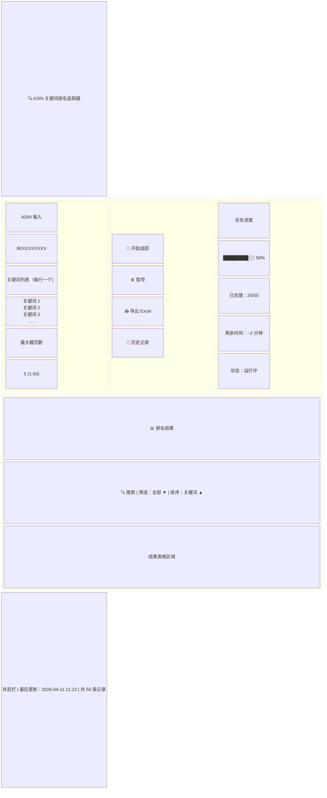

### 1.2 输入区域详细布局

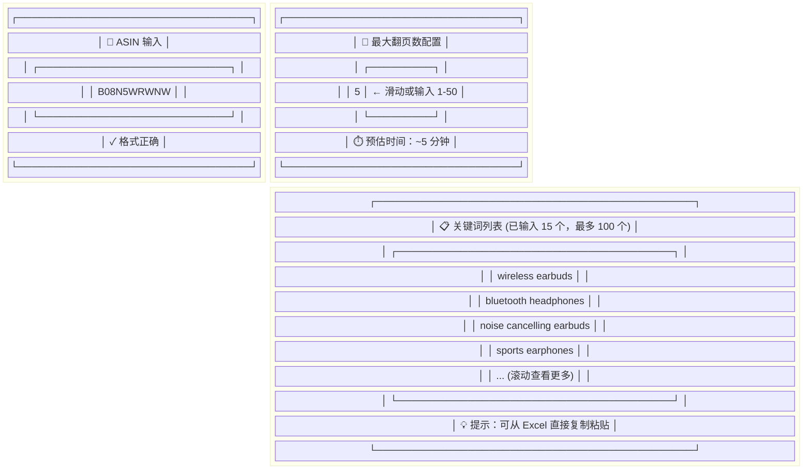

### 1.3 结果表格布局

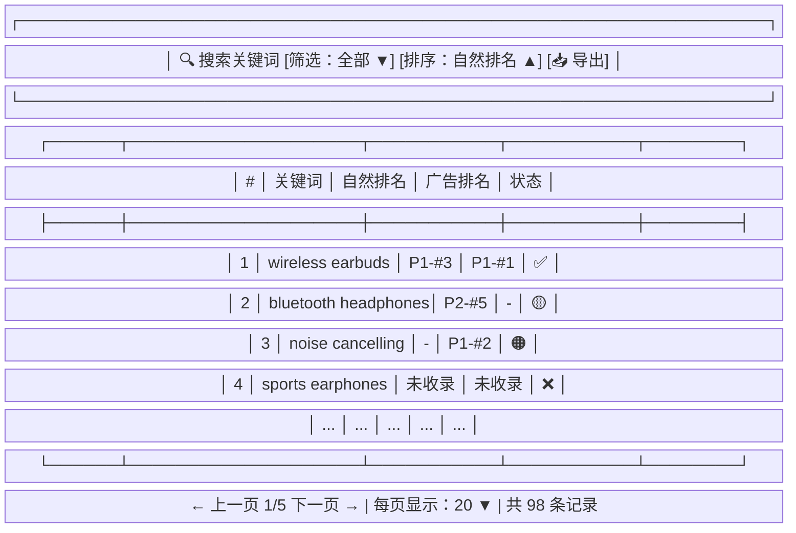

---

## 2. 交互流程图

### 2.1 完整用户操作流程

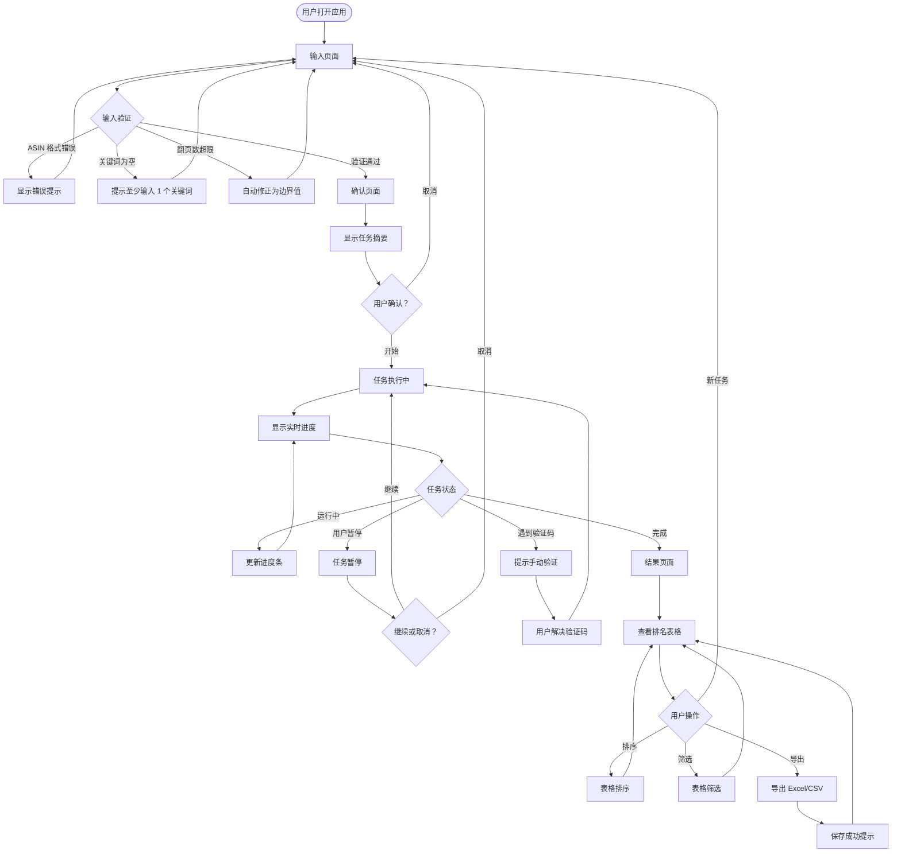

### 2.2 数据爬取流程

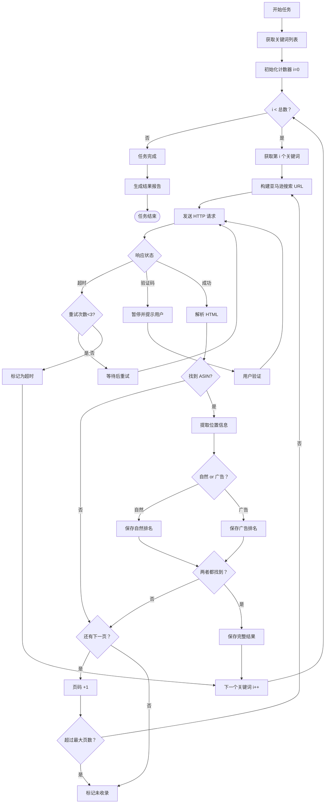

### 2.3 状态机图

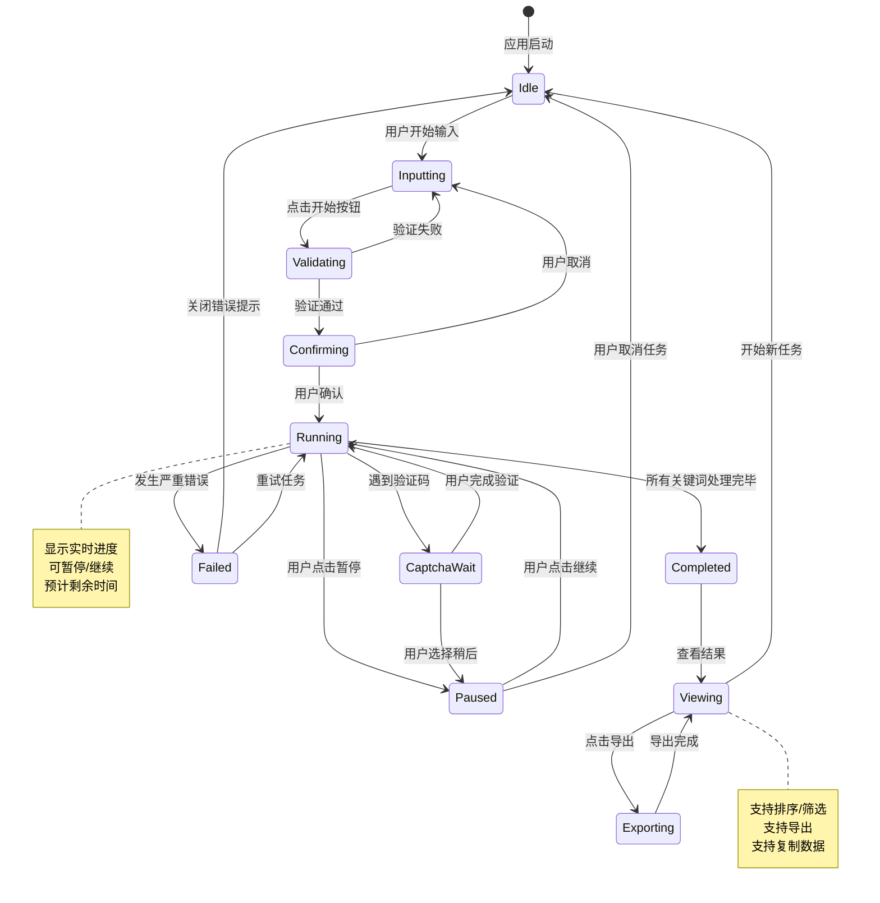

---

## 3. 关键界面状态

### 3.1 空状态（无数据时）

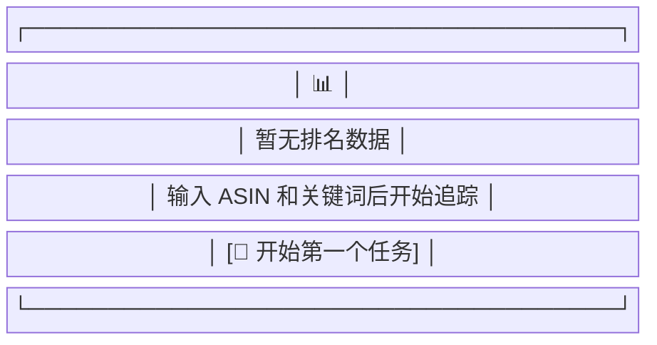

### 3.2 加载中状态

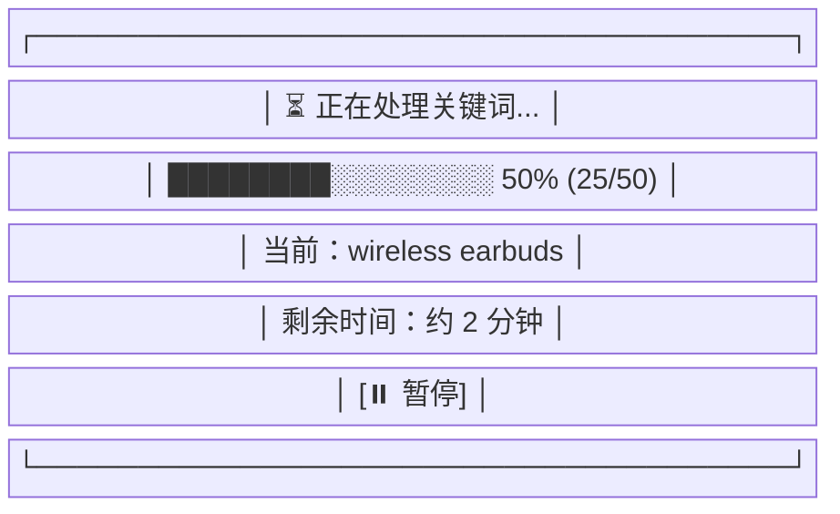

### 3.3 错误状态

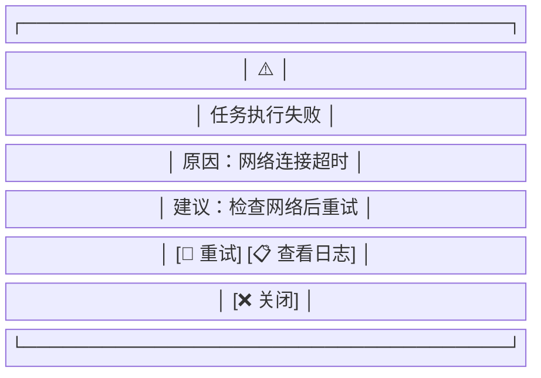

---

## 4. 响应式布局说明

### 4.1 桌面端（≥1200px）

```
┌─────────────────────────────────────────────────────────┐
│  Header (Logo + 标题)                                    │
├─────────────────────────────────────────────────────────┤
│  ┌─────────────┐  ┌─────────────┐  ┌─────────────┐     │
│  │             │  │             │  │             │     │
│  │  ASIN 输入   │  │  控制按钮   │  │  任务状态   │     │
│  │             │  │             │  │             │     │
│  │  关键词列表  │  │  开始/暂停  │  │  进度条     │     │
│  │             │  │             │  │             │     │
│  │  翻页配置   │  │  导出/历史  │  │  统计信息   │     │
│  └─────────────┘  └─────────────┘  └─────────────┘     │
├─────────────────────────────────────────────────────────┤
│  结果表格区域（全宽）                                     │
│  ┌─────────────────────────────────────────────────┐   │
│  │ 工具栏 + 表格 + 分页                              │   │
│  └─────────────────────────────────────────────────┘   │
└─────────────────────────────────────────────────────────┘
```

### 4.2 平板端（768px - 1199px）

```
┌─────────────────────────────────────┐
│  Header                              │
├─────────────────────────────────────┤
│  ┌───────────────┐ ┌───────────────┐│
│  │  ASIN 输入     │ │  控制按钮     ││
│  │  关键词列表   │ │  任务状态     ││
│  │  翻页配置     │ │  进度条       ││
│  └───────────────┘ └───────────────┘│
├─────────────────────────────────────┤
│  结果表格区域（可横向滚动）            │
└─────────────────────────────────────┘
```

### 4.3 移动端（<768px）

```
┌─────────────────────┐
│  Header             │
├─────────────────────┤
│  ASIN 输入          │
├─────────────────────┤
│  关键词列表         │
├─────────────────────┤
│  翻页配置           │
├─────────────────────┤
│  开始按钮           │
├─────────────────────┤
│  任务状态/进度      │
├─────────────────────┤
│  结果表格           │
│  (简化列，可滑动)   │
└─────────────────────┘
```

---

## 5. 组件交互细节

### 5.1 关键词输入框

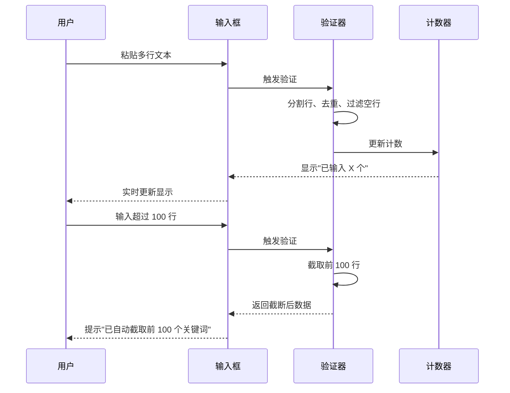

### 5.2 进度条更新

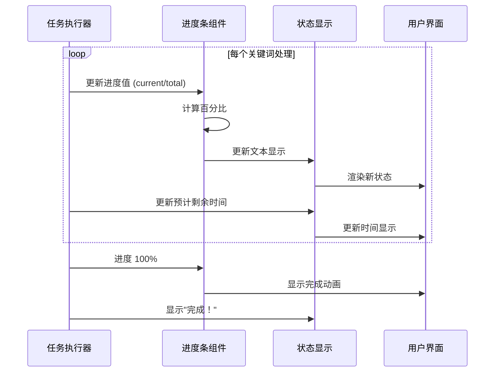

---

## 6. 数据流向图

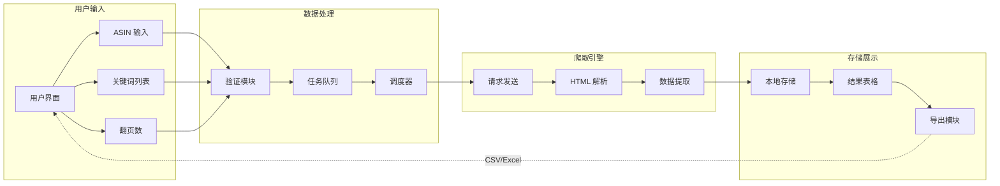

---

*原型图文档结束*
